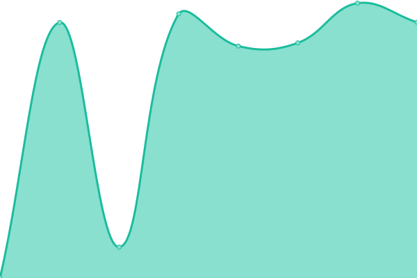

# [📈 Live Status](https://aisbergde.github.io/upptime): <!--live status--> **🟧 Partial outage**

This repository contains the open-source uptime monitor and status page for [Germo Görtz](www.aisberg.de), powered by [Upptime](https://github.com/upptime/upptime).

With [Upptime](https://upptime.js.org), you can get your own unlimited and free uptime monitor and status page, powered entirely by a GitHub repository. We use [Issues](https://github.com/aisbergde/upptime/issues) as incident reports, [Actions](https://github.com/aisbergde/upptime/actions) as uptime monitors, and [Pages](https://aisbergde.github.io/upptime) for the status page.

<!--start: status pages-->
<!-- This summary is generated by Upptime (https://github.com/upptime/upptime) -->
<!-- Do not edit this manually, your changes will be overwritten -->
<!-- prettier-ignore -->
| URL | Status | History | Response Time | Uptime |
| --- | ------ | ------- | ------------- | ------ |
|  [goertz-invest.de](https://goertz-invest.de) | 🟥 Down | [goertz-invest-de.yml](https://github.com/aisbergde/upptime/commits/HEAD/history/goertz-invest-de.yml) | 

 1197ms
     
 | 

<a href="https://aisbergde.github.io/upptime/history/goertz-invest-de">99.99%</a>
    

|  [germo-goertz.de](https://germo-goertz.de) | 🟥 Down | [germo-goertz-de.yml](https://github.com/aisbergde/upptime/commits/HEAD/history/germo-goertz-de.yml) | 

 1141ms
     
 | 

<a href="https://aisbergde.github.io/upptime/history/germo-goertz-de">100.00%</a>
    

|  [der-immobilien-investor.de](https://der-immobilien-investor.de/) | 🟩 Up | [der-immobilien-investor-de.yml](https://github.com/aisbergde/upptime/commits/HEAD/history/der-immobilien-investor-de.yml) | 

 1078ms
     
 | 

<a href="https://aisbergde.github.io/upptime/history/der-immobilien-investor-de">100.00%</a>
    

|  [felicia-xenia.de](https://felicia-xenia.de/) | 🟩 Up | [felicia-xenia-de.yml](https://github.com/aisbergde/upptime/commits/HEAD/history/felicia-xenia-de.yml) | 

 1023ms
     
 | 

<a href="https://aisbergde.github.io/upptime/history/felicia-xenia-de">100.00%</a>
    

|  [boruch-art.de](https://boruch-art.de/) | 🟩 Up | [boruch-art-de.yml](https://github.com/aisbergde/upptime/commits/HEAD/history/boruch-art-de.yml) | 

 846ms
     
 | 

<a href="https://aisbergde.github.io/upptime/history/boruch-art-de">100.00%</a>
    

|  [levitskaia-art.de](https://levitskaia-art.de/) | 🟩 Up | [levitskaia-art-de.yml](https://github.com/aisbergde/upptime/commits/HEAD/history/levitskaia-art-de.yml) | 

 1010ms
     
 | 

<a href="https://aisbergde.github.io/upptime/history/levitskaia-art-de">100.00%</a>
    

|  [steinberg-art.com](https://steinberg-art.com/) | 🟩 Up | [steinberg-art-com.yml](https://github.com/aisbergde/upptime/commits/HEAD/history/steinberg-art-com.yml) | 

 658ms
     
 | 

<a href="https://aisbergde.github.io/upptime/history/steinberg-art-com">100.00%</a>
    

|  [steinberg-design.de](https://steinberg-design.de/) | 🟩 Up | [steinberg-design-de.yml](https://github.com/aisbergde/upptime/commits/HEAD/history/steinberg-design-de.yml) | 

 822ms
     
 | 

<a href="https://aisbergde.github.io/upptime/history/steinberg-design-de">100.00%</a>
    

|  [germo-goertz.fincrm.de](https://germo-goertz.fincrm.de/) | 🟩 Up | [germo-goertz-fincrm-de.yml](https://github.com/aisbergde/upptime/commits/HEAD/history/germo-goertz-fincrm-de.yml) | 

 557ms
     
 | 

<a href="https://aisbergde.github.io/upptime/history/germo-goertz-fincrm-de">100.00%</a>
    

|  [akademie.germo-goertz.de](https://akademie.germo-goertz.de/) | 🟩 Up | [akademie-germo-goertz-de.yml](https://github.com/aisbergde/upptime/commits/HEAD/history/akademie-germo-goertz-de.yml) | 

 1037ms
     
 | 

<a href="https://aisbergde.github.io/upptime/history/akademie-germo-goertz-de">100.00%</a>
    

|  [http://www.vineyardsaker.de/](http://www.vineyardsaker.de/) | 🟩 Up | [http-www-vineyardsaker-de.yml](https://github.com/aisbergde/upptime/commits/HEAD/history/http-www-vineyardsaker-de.yml) | 

 2761ms
     
 | 

<a href="https://aisbergde.github.io/upptime/history/http-www-vineyardsaker-de">100.00%</a>
    

<!--end: status pages-->

[**Visit our status website →**](https://aisbergde.github.io/upptime)

## 📄 License

- Powered by: [Upptime](https://github.com/upptime/upptime)
- Code: [MIT](./LICENSE) © [Anand Chowdhary](https://anandchowdhary.com), supported by [Pabio](https://pabio.com)
- Data in the `./history` directory: [Open Database License](https://opendatacommons.org/licenses/odbl/1-0/)
